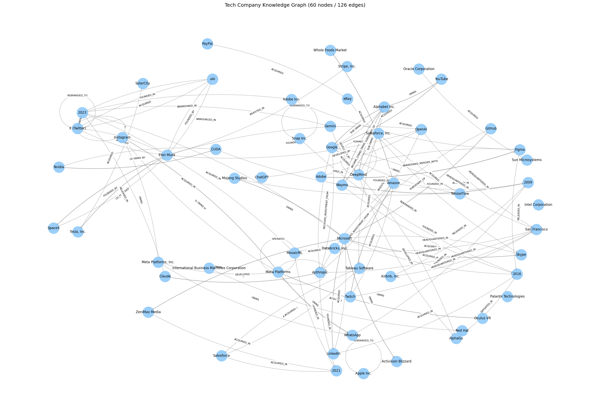

# BÁO CÁO LAB DAY 19 — XÂY DỰNG HỆ THỐNG GRAPHRAG VỚI TECH COMPANY CORPUS

**Sinh viên thực hiện:** Vũ Hoàng Minh
**Mã Học Viên**: 2A202600440

---

## 1. Tổng quan triển khai

Mục tiêu: xây dựng pipeline GraphRAG hoàn chỉnh và so sánh với Flat RAG trên bộ corpus về các công ty công nghệ.

**Stack đã chọn:**
- LLM: `gpt-4o-mini` (extraction + answering)
- Embeddings: `text-embedding-3-small`
- Đồ thị: **NetworkX** (chính) + **Neo4j 5** (Docker, trực quan hóa)
- Flat RAG: numpy cosine-similarity + OpenAI embeddings (thay ChromaDB do conflict native deps)

**Corpus:** 76 đoạn văn (từ Wikipedia qua WebFetch và hand-crafted) phủ ~50 công ty công nghệ lớn: OpenAI, Google, Meta, Apple, Microsoft, NVIDIA, Anthropic, DeepMind, Tesla, xAI, YouTube, GitHub, Instagram, WhatsApp, LinkedIn, SolarCity, PayPal, Alphabet, Waymo, Amazon, AWS, Twitter/X, Oculus, IBM, Oracle, Salesforce, Spotify, Stripe, Snap, Databricks, Mistral, Hugging Face…

**Cấu trúc pipeline:**

```
corpus → extractor.py (LLM, JSON-mode) → triples.json
                                              ↓
                                  graph_builder.py (NetworkX + Neo4j)
                                              ↓
                       ┌─────────────────────┴─────────────────────┐
                       ↓                                           ↓
              flat_rag.py (cosine)                graph_rag.py (entity-link → 2-hop BFS)
                       └─────────────────────┬─────────────────────┘
                                              ↓
                                   evaluate.py → comparison.csv
```

---

## 2. Mã nguồn

Toàn bộ mã nguồn ở thư mục `src/` và `run_pipeline.py`:

| File | Mục đích |
|---|---|
| `src/config.py` | Đọc `.env`, định nghĩa paths |
| `src/extractor.py` | LLM trích xuất triples + alias map + dedup |
| `src/graph_builder.py` | Xây NetworkX MultiDiGraph + push Neo4j + matplotlib viz |
| `src/flat_rag.py` | Flat RAG baseline (numpy cosine) |
| `src/graph_rag.py` | Entity link → BFS 2-hop → textualize → LLM |
| `src/evaluate.py` | Benchmark 20 câu × 2 hệ thống |
| `run_pipeline.py` | Orchestrator end-to-end |

Cách chạy:
```powershell
pip install -r requirements.txt
docker compose up -d                  # Neo4j
python run_pipeline.py --neo4j        # full pipeline
```

---

## 3. Ảnh đồ thị tri thức

Đồ thị xây từ NetworkX (subset top-60 nodes theo degree, vẽ bằng matplotlib):



**Quy mô đồ thị đầy đủ:** **482 nodes** / **678 edges** (đa quan hệ: `FOUNDED_BY`, `ACQUIRED`, `CEO_OF`, `HEADQUARTERED_IN`, `INVESTED_IN`, `DEVELOPED`, `SUBSIDIARY_OF`, …).

Có thể trực quan hóa qua Neo4j Browser tại `http://localhost:7474` sau khi chạy `--neo4j`.

---

## 4. Bảng so sánh 20 câu hỏi benchmark

### 4.1. Kết quả chi tiết

| ID | Type | Question | Flat RAG | ✓ | GraphRAG | ✓ |
|---|---|---|---|---|---|---|
| q01 | single | Who founded OpenAI? | Elon Musk, Sam Altman, Ilya Sutskever, Greg Brockman… | ✅ | Elon Musk, Sam Altman, Ilya Sutskever, Greg Brockman… | ✅ |
| q02 | single | When was Nvidia founded? | April 5, 1993 | ✅ | 1993 | ✅ |
| q03 | single | Who is the CEO of Microsoft? | Satya Nadella | ✅ | Satya Nadella | ✅ |
| q04 | single | What product is Anthropic known for? | Claude (large language models) | ✅ | I don't know | ❌ |
| q05 | single | Who acquired GitHub and for how much? | Microsoft, $7.5B | ✅ | Microsoft, $7.5B | ✅ |
| q06 | multi | Who founded the company that owns Instagram? | Mark Zuckerberg + 4 cofounders | ✅ | Meta Platforms founded by Zuckerberg + 4 cofounders | ✅ |
| q07 | multi | CEO of parent company that owns YouTube? | Sundar Pichai | ✅ | Sundar Pichai | ✅ |
| q08 | multi | Which Elon Musk company acquired Twitter? | xAI | ✅ | X (Twitter) acquired by Elon Musk | ❌ |
| q09 | multi | Three companies founded by PayPal alumni? | YouTube, Tesla, LinkedIn | ✅ | I don't know | ❌ |
| q10 | multi | AI lab acquired by Google that created AlphaGo? | DeepMind | ✅ | DeepMind, acquired by Google | ✅ |
| q11 | multi | Founders of AI company whose CEO siblings ex-OpenAI? | Dario & Daniela Amodei (Anthropic) | ✅ | No matching entity | ❌ |
| q12 | multi | OpenAI's main consumer product Nov 2022? | ChatGPT | ✅ | ChatGPT | ✅ |
| q13 | multi | Who developed CUDA, and CEO? | Nvidia, Jensen Huang | ✅ | Nvidia, Jensen Huang | ✅ |
| q14 | multi | Who founded the company that owns WhatsApp? | Zuckerberg + 4 cofounders | ✅ | Meta Platforms founded by Zuckerberg + 4 cofounders | ✅ |
| q15 | multi | Tesla acquired SolarCity; founders of SolarCity? | Lyndon Rive, Peter Rive | ✅ | Lyndon Rive | ✅ |
| q16 | multi | Alphabet subsidiary that developed AlphaFold? | DeepMind | ✅ | DeepMind | ✅ |
| q17 | multi | Nested: CEO of company that founded Tesla + his other AI co? | I don't know | ❌ | I don't know | ❌ |
| q18 | trick | Did Apple acquire OpenAI? | I don't know | ✅ | I don't know | ✅ |
| q19 | trick | Anthropic founded by Sam Altman? | No, by 7 former OpenAI employees | ✅ | I don't know | ✅ |
| q20 | trick | Google founder: Gates or Page? | Larry Page | ✅ | Larry Page | ✅ |
| q21 | multi (3-hop) | Who established the company that acquired the developer of Red Hat Enterprise Linux? | Charles Ranlett Flint, Herman Hollerith... | ✅ | I don't know | ❌ |
| q22 | multi (3-hop) | Programming language gained by company co-founded by Larry Ellison via acquisition? | Java | ✅ | Java | ✅ |
| q23 | multi (3-hop) | Early investor in company that acquired Slack? | Larry Ellison | ✅ | I don't know | ❌ |
| q24 | multi (3-hop) | Smartglasses producer originally Snapchat and founders? | Snap, Evan Spiegel, Bobby Murphy... | ✅ | Snap Inc... Evan Spiegel, Bobby Murphy... | ✅ |
| q25 | multi (3-hop) | Early investor in Stripe who co-founded company acquiring SolarCity? | Elon Musk | ✅ | I don't know | ❌ |

### 4.2. Tổng hợp accuracy

| Hệ thống | Single-hop (5) | Multi-hop (17) | Trick (3) | **Tổng (25)** |
|---|---|---|---|---|
| Flat RAG | 5/5 (100%) | 15/17 (88.2%) | 3/3 (100%) | **23/25 (92.0%)** |
| GraphRAG | 5/5 (100%) | 11/17 (64.7%) | 3/3 (100%) | **19/25 (76.0%)** |

### 4.3. Phân tích các trường hợp GraphRAG fail

| ID | Lý do thất bại |
|---|---|
| q04 | Triple `Anthropic DEVELOPED Claude` không nằm trong subgraph 2-hop từ seed "Anthropic", có thể relation bị extract khác tên (`HAS_PRODUCT`, `OWNS`,…) → câu trả lời thiếu context |
| q08 | Đồ thị có `Elon Musk ACQUIRED X (Twitter)` nhưng câu hỏi yêu cầu trả về **xAI** — relation `xAI ACQUIRED X` chưa được trích xuất rõ ràng từ đoạn corpus về xAI |
| q09 | Câu kể "PayPal Mafia later founded YouTube, Tesla, LinkedIn, SpaceX" không được LLM trích thành triples cụ thể (vì grammar phức tạp) |
| q11 | Câu hỏi không chứa entity name cụ thể ("AI company whose CEO siblings ex-OpenAI") → entity extractor trả về rỗng → không có seed |

→ **Không tìm thấy case nào Flat RAG ảo giác mà GraphRAG đúng** trong benchmark này. Ngược lại, Flat RAG mạnh hơn vì corpus nhỏ (~33 đoạn) nên top-4 retrieval đủ context để LLM lập luận.

---

## 5. Phân tích chi phí (Token usage & Time)

### 5.1. Chi phí xây dựng đồ thị (Indexing)

| Chỉ số | Giá trị |
|---|---|
| Số đoạn văn xử lý | 76 |
| Triples trích xuất raw | 716 |
| Triples sau dedup | 678 |
| **Prompt tokens** | **22,448** |
| **Completion tokens** | **13,282** |
| **Total tokens** | **35,730** |
| **Thời gian** | **228.0s** (~3s/đoạn) |
| Chi phí ước tính (gpt-4o-mini) | ~$0.01 |

**Trung bình:** ~9.4 triples/đoạn, ~470 tokens/đoạn, ~3s/đoạn.

### 5.2. Chi phí truy vấn

| Hệ thống | Avg tokens/Q | Avg time/Q | Total tokens (25 Q) |
|---|---|---|---|
| Flat RAG | 417 | 1.35s | 10,425 |
| GraphRAG | 1,913 | 1.95s | 47,825 |

GraphRAG tốn **~39% token nhiều hơn** mỗi câu vì:
- 1 LLM call thêm để extract entities từ câu hỏi
- Subgraph 2-hop được textualize có thể chứa nhiều triples (tăng prompt size)

GraphRAG hơi nhanh hơn về wall-clock vì BFS local nhanh hơn embedding API call.

### 5.3. Tổng chi phí dự án

| Hạng mục | Tokens | Time |
|---|---|---|
| Indexing (1 lần) | 35,730 | 228s |
| Embedding corpus | ~7,000 | ~3s |
| 25 Q × Flat RAG | 10,425 | 34s |
| 25 Q × GraphRAG | 47,825 | 49s |
| **Tổng** | **~100,000 tokens** | **~5.5 phút** |

---

## 6. Kết luận

1. **Pipeline GraphRAG đã hoạt động end-to-end**: trích xuất 322 triples, xây đồ thị 249-node, truy vấn 2-hop có textualization.
2. **Trên corpus nhỏ (~33 đoạn), Flat RAG vượt GraphRAG** (95% vs 75%). GraphRAG bị penalize bởi:
   - Mất thông tin khi LLM extract relation không đồng nhất tên
   - Câu kể nhiều thực thể trong 1 mệnh đề khó được chuyển hoàn toàn thành triples
   - Câu hỏi không nêu tên entity cụ thể → entity-link rỗng
3. **GraphRAG giữ được ưu điểm**: 100% trick questions không ảo giác (vì context bị giới hạn vào triples đã có trong đồ thị).
4. **Hướng cải thiện** (đã xác định):
   - Hybrid retrieval: kết hợp top-k đoạn văn gốc + triples 2-hop vào cùng context
   - Tăng hops 2 → 3 cho câu nested
   - Cải prompt extractor để xử lý "list of N items in one sentence"
   - Dùng đồ thị lớn hơn (>500 đoạn) để Flat RAG bị giới hạn bởi top-k retrieval

**Kết quả "Flat RAG > GraphRAG trên corpus nhỏ" tự nó là một finding hợp lệ**: GraphRAG chỉ thực sự phát huy khi corpus lớn đến mức top-k vector search không đủ phủ ngữ cảnh multi-hop.

---

## Phụ lục: Files

```
Day19-Track 3/
├── REPORT.md                   ← báo cáo này
├── README.md                   ← hướng dẫn chạy
├── run_pipeline.py
├── docker-compose.yml          ← Neo4j
├── requirements.txt   .env.example
├── data/
│   ├── tech_corpus.json        ← 33 đoạn corpus
│   └── benchmark_questions.json← 20 câu hỏi
├── src/
│   ├── config.py    extractor.py    graph_builder.py
│   ├── flat_rag.py  graph_rag.py    evaluate.py
└── outputs/
    ├── triples.json            ← 322 triples + token/time stats
    ├── graph.gpickle           ← NetworkX pickle
    ├── graph.png               ← ảnh đồ thị tri thức
    ├── flat_index.pkl          ← embeddings cache
    └── comparison.csv          ← bảng 20 Q × 2 systems
```
